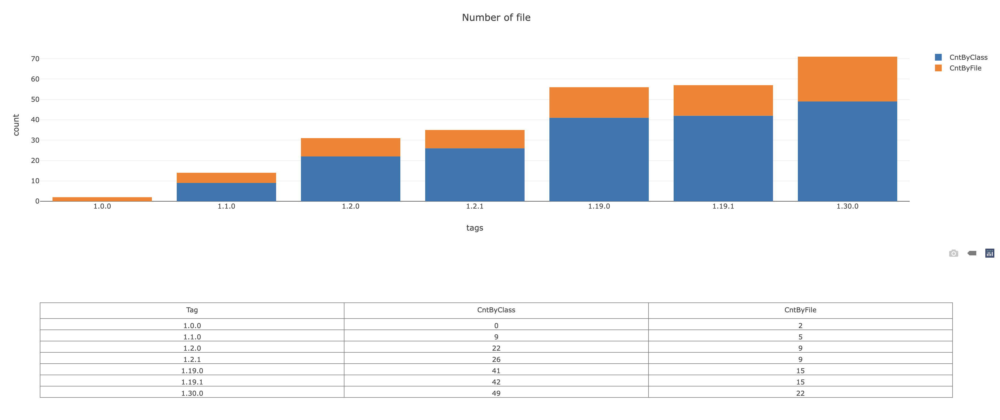

# ABACUS PLUGIN DEMO

Demo project for the [abacus gradle plugin](https://github.com/alecarnevale/abacus-plugin).

## Configuration
```
abacus {
  val cls = listOf("Continent", "Felidae", "Africa", "Asia", "Europe", "NorthAmerica", "SouthAmerica", "Oceania", "Antarctica", "Pantherinae", "Felinae")
  val exts = listOf("xml")
  val folders = listOf("ancient", "natural", "new")
  supertypes.set(cls)
  fileExtensions.set(exts)
  fileFolders.set(folders)
}
```

## Outputs
- `./gradlew abacusTags` generates list of tags in `build/abacus/tags.txt`
- `./gradlew abacus` generates `build/abacus/output.csv` and `build/abacus/plot.html`

## Plot
